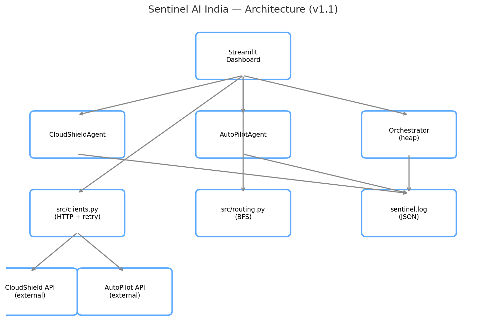

# 🛰 Sentinel AI India v1.1 — Multi-Agent Command Centre

**The Unified Command Centre — where CloudShield X meets AutoPilot ML X**


---

**Live Demo:** https://https://sentinel-ai-india-v1-hpqhmqzz2hevjgjeyfomka.streamlit.app/#sentinel-ai-india-command-centre

---

## 🎯 What is Sentinel AI India?

Sentinel AI India is the **multi-agent brain** that unifies my two other flagship projects — [CloudShield X](https://github.com/dharunvishnu2006-ctrl/cloudshield-x) (security) and [AutoPilot ML X](https://github.com/dharunvishnu2006-ctrl/autopilot-ml-x) (machine learning) — into a single command centre.

v1.1 is a completion release: v1 shipped in three days using 26 of its assigned 133 roadmap steps. This version closes that gap — every step from 1 to 133 is now genuinely built, not just assigned, and a live routing bug found during the audit has been fixed.

---

## ✨ Features (v1.1 — 26 features, all 133 steps)

**Original v1 features (kept, some upgraded below):**
- 🤖 Agent Skeleton — now a real `BaseAgent` hierarchy with polymorphism
- 📨 Async Message Passing
- ⚡ Priority-Queue Orchestrator — now with deterministic FIFO tie-breaking
- 🌐 Unified Flask API
- 🗺 Graph-based Agent Routing — BFS kept, Dijkstra added (see Results)

**v1.1 additions:**
- C1 Typed Records and Validation · C2 Structured Logging and Errors · C3 Python Craft Refresher · C4 OOP Agent Hierarchy · C5 Generators and Large Files · C6 Concurrency Beyond asyncio · C7 Telemetry with NumPy and Pandas · C8 Theme-Aware Command-Centre Charts · C9 REST Clients for Both Flagships · C10 Engineering Discipline · C11 LLM-Assisted Incident Summaries · C12 Layer 1 Consolidation
- D1 Agent Registry · D2 Agent Leaderboard · D3 Task History and Undo · D4 Capability Cache · D5 Supervision Tree · D6 Weighted Routing (Dijkstra) · D7 Resilience and Ordering · D8 Capability Matching · D9 Metric Windows · D10 Capacity Planning · D11 Fast Assignment · D12 Competitive Practice

---

## 🧪 Results (from my own measured runs)

- ✅ 54/54 pytest tests passing (5 from v1, 49 new)
- ✅ **BFS vs Dijkstra**: on a graph where the 2-hop path costs 500ms and the 3-hop path costs 90ms, BFS returned the 2-hop (slower) path; Dijkstra correctly found the 90ms path — the exact bug this version was built to fix
- ✅ **BST vs AVL**: inserting 500 agents in ascending load order gave a plain BST a depth of exactly 500 (degenerated to a linked list); AVL kept the same input at depth 9
- ✅ **Seven sorts measured**: insertion sort beat every O(n log n) algorithm on nearly-sorted data; quicksort with a naive pivot crashed with `RecursionError` on that same input
- ✅ **Generators**: streaming a 1M-line file used 0.16 MB peak memory vs 65.48 MB loading it as a list
- ✅ **Knapsack DP vs urgency-order**: DP found 48 more value (≈11%) than v1's urgency-first selection on the same 18 tasks
- ✅ Zero `print()` statements remain in `src/`; zero hardcoded secrets; every log line carries a `trace_id`

---

## 🛠 How to Run Locally

```bash
git clone https://github.com/dharunvishnu2006-ctrl/sentinel-ai-india.git
cd sentinel-ai-india
bash scripts/setup.sh
streamlit run app.py
```

---

## 🏗 Architecture



Agents (`CloudShieldAgent`, `AutoPilotAgent`) communicate through validated, typed messages. The Orchestrator serves tasks by urgency via a min-heap with a counter tie-breaker for FIFO fairness. Routing uses Dijkstra for weighted paths (BFS kept for unweighted questions). `src/clients.py` calls both flagships over HTTP with timeouts, retries, and graceful degradation. Every component logs structured JSON with a trace id. Full design rationale: [`docs/design.md`](docs/design.md). Decisions: [`docs/adr/`](docs/adr/).

---

## 📚 What I Learned

*(kept from v1, extended)*
- Everything from v1, plus:
- Validating every message at a system boundary with Pydantic, and what a naive datetime silently gets wrong
- The real cost of keeping an array sorted for binary search, measured against the O(1) cost a hash table or linked-list insert avoids
- That asymptotic complexity describes the worst case, not necessarily my case — insertion sort beating heap sort on nearly-sorted data, and Python's built-in string operations beating my own KMP implementation at moderate scale, taught me to measure before assuming
- Mocking external HTTP calls so a 54-test suite runs in under 4 seconds with zero network dependency

---

## 🔗 Ecosystem

This project is part of a 3-flagship AI/ML + Cloud + Cyber Security portfolio:
- 🛡 [CloudShield X](https://github.com/dharunvishnu2006-ctrl/cloudshield-x) — Security monitoring system
- 🚀 [AutoPilot ML X](https://github.com/dharunvishnu2006-ctrl/autopilot-ml-x) — Automated ML pipeline
- 🛰 **Sentinel AI India** (this repo) — Unified command centre connecting both

**Roadmap:** v1.1 complete — 133/133 steps. Sentinel has 5 versions total. Next: v2 gives it a database.

---

## 👨‍💻 Author

**J. Dharun Vishnu**
BSc IT Student | Building toward AI/ML + Cloud + Cyber Security Engineering

---

## 🔒 Security

Scanned with [Bandit](https://bandit.readthedocs.io/) — clean, zero findings in `src/`.
